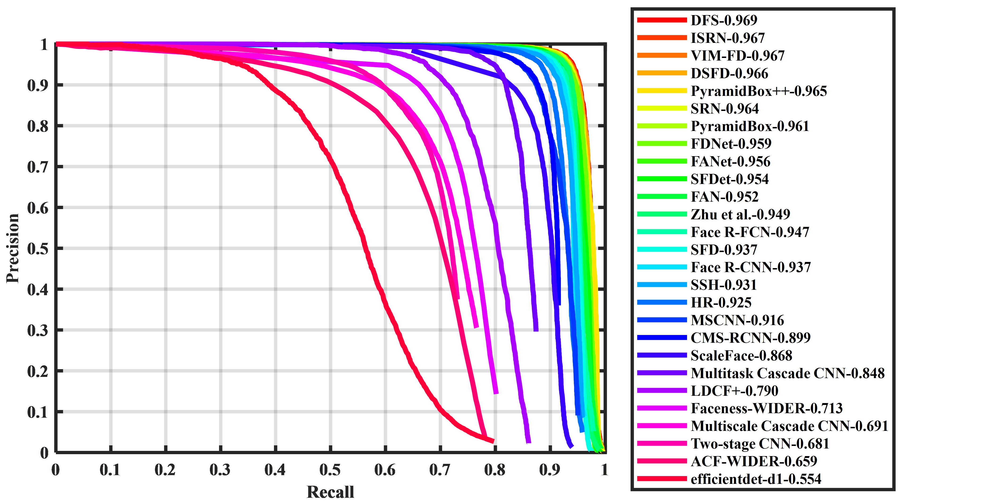

# EfficientDet for Face Detection

A simple conversion made from [the implementation of EfficientDet for object detection]( https://github.com/toandaominh1997/EfficientDet.Pytorch )   

### Changes

Calibrate the anchor size to `[0.8, 1, 1.2]`. Due to limited computational resources, the training process starts with the weight pretained by Toan's team. It can be found [here](https://drive.google.com/open?id=1evKg_s2kTYG-AUeVvlq9cliEEHlJ9TQQ).

### Evaluation

The performance is tested on [WIDERFace]( http://mmlab.ie.cuhk.edu.hk/projects/WIDERFace/WiderFace_Results.html ).

[Official evaluation and plotting scripts for generating the PR curves]( http://mmlab.ie.cuhk.edu.hk/projects/WIDERFace/support/eval_script/eval_tools.zip )

However, the result is not satisfying.

[The weight of above result](https://pan.baidu.com/s/1FVH6jPZSQUSRNFoTZV5t-A). Extraction code : nqc2